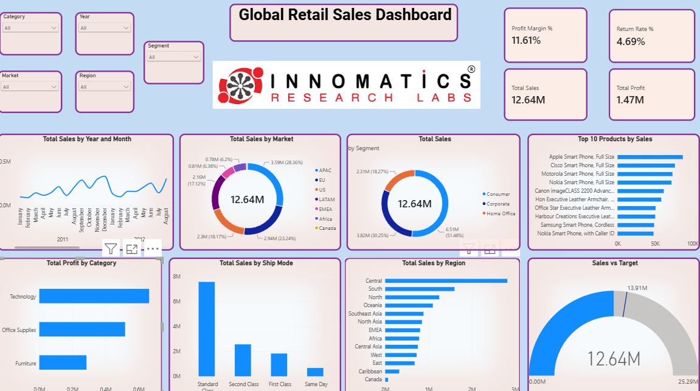
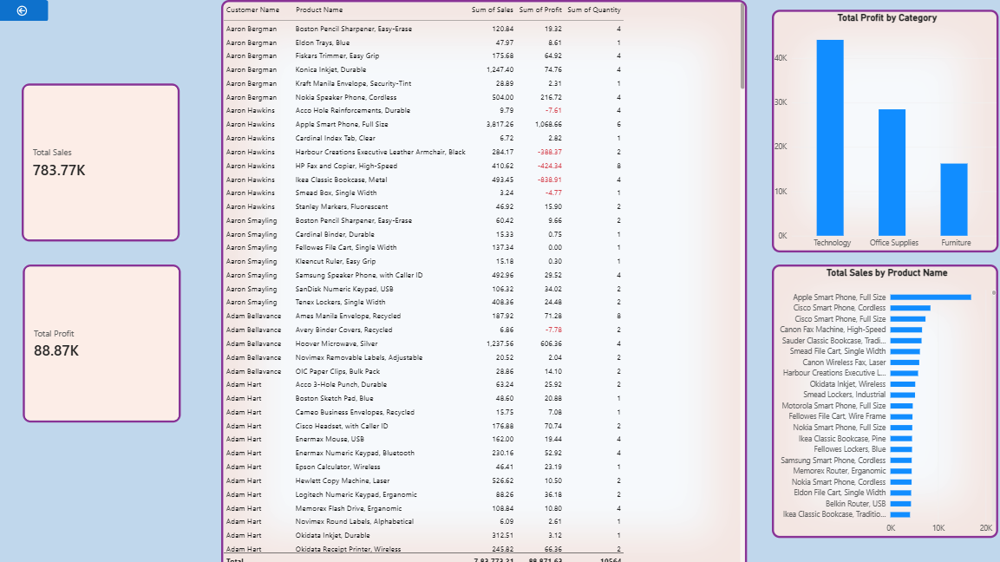

# 📊 Global Retail Sales Dashboard using Power BI

## 📌 Project Overview

This project is an interactive **Global Retail Sales Dashboard** developed using **Microsoft Power BI**.

The dashboard analyzes retail sales data to provide insights into **sales performance, profitability, customer segments, markets, regions, products, shipping modes, and returns**.

The objective of this project is to transform raw retail data into an interactive business intelligence dashboard that helps users understand sales and profitability performance.

---

## 🎯 Project Objectives

- Analyze overall sales and profit performance
- Identify sales trends over time
- Compare sales across different markets and regions
- Analyze sales by customer segment
- Identify top-performing products
- Analyze profit by category
- Compare sales across shipping modes
- Monitor sales against targets
- Analyze return rate and profitability
- Create an interactive dashboard for business analysis

---

## 🛠️ Tools & Technologies

- **Microsoft Power BI**
- **Power Query**
- **DAX**
- **Microsoft Excel**
- **Data Modeling**
- **Data Visualization**

---

## 📂 Dataset

The project uses the **Global Superstore** retail dataset.

The dataset contains information related to:

- Orders
- Customers
- Products
- Sales
- Profit
- Quantity
- Markets
- Regions
- Categories
- Segments
- Shipping Modes
- Returns

The raw dataset used for the project is included in this repository.

---

## 🔄 Data Preparation

The raw dataset was imported into Power BI and prepared using **Power Query**.

The data preparation process included:

1. Importing the raw dataset
2. Inspecting the data structure
3. Cleaning and transforming the data
4. Handling data types and required fields
5. Creating calculated measures using DAX
6. Building the data model
7. Creating interactive visualizations
8. Designing the final dashboard

---

## 📐 Key KPIs

| KPI | Value |
|---|---:|
| Total Sales | 12.64M |
| Total Profit | 1.47M |
| Profit Margin | 11.61% |
| Return Rate | 4.69% |

---

## 📊 Dashboard Features

### 1. Executive Sales Dashboard

The main dashboard provides an overview of retail performance.

It includes:

- Total Sales
- Total Profit
- Profit Margin %
- Return Rate %
- Sales by Year and Month
- Sales by Market
- Sales by Segment
- Top 10 Products by Sales
- Profit by Category
- Sales by Ship Mode
- Sales by Region
- Sales vs Target

### Interactive Filters

Users can filter the dashboard using:

- Category
- Year
- Market
- Region
- Segment

---

### 2. Detailed Sales Analysis

The detailed analysis page provides customer- and product-level information.

It includes:

- Customer Name
- Product Name
- Sales
- Profit
- Quantity
- Profit by Category
- Sales by Product Name

This page helps users examine individual customer and product performance.

---

## 💡 Key Insights

- Total sales are approximately **12.64M**.
- Total profit is approximately **1.47M**.
- Overall profit margin is approximately **11.61%**.
- The return rate is approximately **4.69%**.
- Technology contributes the highest profit among the displayed categories.
- Standard Class is the largest shipping mode by sales.
- The dashboard allows sales performance to be compared across different markets and regions.
- The Top 10 Products visual highlights products with the highest sales contribution.
- Monthly and yearly sales trends can be analyzed interactively.

---

## 🖼️ Dashboard Screenshots

### Global Retail Sales Dashboard



### Detailed Sales Analysis



---

## 📁 Project Files

```text
Global-Retail-Sales-Dashboard-using-Power-BI/
│
├── Detailed_Sales_Analysis.png
├── Global_Retail_Sales_Dashboard.png
├── GlobalSuperstore Data (1).xlsx
├── Power BI Project.pbix
└── README.md

